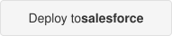

# USWDS → Lightning Web Components

1:1 conversions of [U.S. Web Design System (USWDS)](https://designsystem.digital.gov/) components into Salesforce Lightning Web Components for Experience Cloud sites.

Each LWC maps directly to a USWDS component — same visual output, same accessibility patterns, zero external dependencies. Drop them into Experience Cloud and your site looks like a real government website.

## What is USWDS?

The [U.S. Web Design System (USWDS)](https://designsystem.digital.gov/) is the official design system of the federal government, created and maintained by the [General Services Administration (GSA)](https://www.gsa.gov/). It provides a library of open-source UI components, design tokens, and page templates that government agencies use to build their public-facing websites.

You can explore the full system at **[designsystem.digital.gov](https://designsystem.digital.gov/)**.

### Why it matters

Government digital services serve everyone — including people with disabilities, limited English proficiency, low bandwidth, and older devices. USWDS exists to make sure those services are **consistent** and **accessible** by default:

- **Consistency** — When every agency uses the same components, colors, typography, and interaction patterns, citizens get a familiar experience across all government websites. A form on a health benefits site works the same way as a form on a permit application. This reduces confusion, builds trust, and makes government feel like one coordinated service rather than hundreds of disconnected websites.

- **Accessibility** — USWDS components are built to meet [Section 508](https://www.section508.gov/) and [WCAG 2.1 AA](https://www.w3.org/WAI/WCAG21/quickref/) accessibility standards out of the box. Proper color contrast, keyboard navigation, screen reader support, focus management, and semantic HTML are baked into every component. Agencies that adopt USWDS don't have to solve these problems from scratch — they inherit tested, compliant patterns.

- **Trust** — Elements like the .gov banner and consistent visual language signal to the public that they are on a legitimate government website, not a phishing site or unofficial source.

### Why convert USWDS to LWC?

Many state and local government agencies use Salesforce Experience Cloud for their public-facing portals — permit applications, service requests, case status lookups, and more. Out of the box, Experience Cloud doesn't look like a government website. This project bridges that gap by converting USWDS components into native LWCs so that Salesforce-powered government portals look and feel like the rest of the agency's web presence.

---

## Install

Click the button below to deploy all components directly into your Salesforce org:

<a href="https://githubsfdeploy.herokuapp.com?owner=thenandapurkar&repo=uswds-lwc&ref=main">
  
</a>

### Manual Install

1. Clone this repo
2. Deploy with Salesforce CLI:
   ```bash
   sf project deploy start --source-dir force-app
   ```
3. In Experience Cloud Builder, drag the components onto your pages

---

## Components

### uswdsBannerLwc

**USWDS Original:** [Banner](https://designsystem.digital.gov/components/banner/)

The official U.S. government website identification banner. This is the gray bar at the very top of every .gov site that says "An official website of the United States government" with an expand/collapse panel explaining .gov domains and HTTPS.

**Where to use:** Top of any Experience Cloud page that should look like a government website.

**How to use:**
1. In Experience Cloud Builder, drag `USWDS Banner LWC` onto the top of your page
2. It works out of the box — no configuration needed

**Properties:**

| Property | Type | Default | Description |
|----------|------|---------|-------------|
| `expanded` | Boolean | `false` | Set to `true` to show the explanation panel open by default |

**Example (in a parent LWC):**
```html
<c-uswds-banner-lwc></c-uswds-banner-lwc>

<!-- Or start expanded -->
<c-uswds-banner-lwc expanded></c-uswds-banner-lwc>
```

---

### uswdsEmergencyBannerLwc

**USWDS Original:** [Site Alert](https://designsystem.digital.gov/components/site-alert/)

A full-width site alert banner that toggles between an emergency state (dark red/orange) and an informational all-clear state (light cyan). Use it to communicate urgent information or confirm that there are no active alerts.

**Where to use:** Below the banner at the top of the page, or anywhere you need to display site-wide alerts.

**How to use:**
1. In Experience Cloud Builder, drag `USWDS Emergency Banner LWC` onto your page
2. Configure the heading, message, and emergency state in the component properties

**Properties:**

| Property | Type | Default | Description |
|----------|------|---------|-------------|
| `heading` | String | `"No active emergencies"` | Primary text shown in the banner |
| `message` | String | `""` | Optional secondary message with details |
| `isEmergency` | Boolean | `false` | When `true`, banner switches to emergency red style |
| `height` | String | `""` | Optional minimum height in pixels (e.g. `"60"`) |

**Example:**
```html
<!-- All-clear state -->
<c-uswds-emergency-banner-lwc
    heading="No active emergencies"
    message="All city services are operating normally.">
</c-uswds-emergency-banner-lwc>

<!-- Emergency state -->
<c-uswds-emergency-banner-lwc
    heading="Severe weather warning"
    message="A winter storm warning is in effect. Non-essential city offices are closed."
    is-emergency>
</c-uswds-emergency-banner-lwc>
```

---

### uswdsStepIndicatorLwc

**USWDS Original:** [Step Indicator](https://designsystem.digital.gov/components/step-indicator/)

A multi-step progress indicator that shows where a user is in a sequential process. Supports 4 visual variants: default (bar segments), centered, counters (numbered circles with connectors), and small counters. Works in both Experience Cloud pages and Flow screens.

**Where to use:** Top of any multi-step form, application, or wizard — permit applications, intake forms, service requests.

**How to use:**
1. In Experience Cloud Builder or a Flow Screen, drag `USWDS Step Indicator LWC` onto your page
2. Set the step labels (separated by semicolons) and current step number

**Properties:**

| Property | Type | Default | Description |
|----------|------|---------|-------------|
| `variant` | String | `"default"` | Visual style: `default`, `centered`, `counters`, or `counters-sm` |
| `currentStep` | Integer | `1` | Which step is currently active (1-based) |
| `labels` | String | `"Personal information; Household status; Supporting documents; Signature; Review and submit"` | Step labels separated by semicolons |

**Example:**
```html
<!-- Default bar style -->
<c-uswds-step-indicator-lwc
    variant="default"
    current-step="3"
    labels="Applicant Info; Property Details; Upload Documents; Review; Submit">
</c-uswds-step-indicator-lwc>

<!-- Numbered counters -->
<c-uswds-step-indicator-lwc
    variant="counters"
    current-step="2"
    labels="Create Account; Verify Identity; Complete Application">
</c-uswds-step-indicator-lwc>
```

---

### uswdsSummaryBoxLwc

**USWDS Original:** [Summary Box](https://designsystem.digital.gov/components/summary-box/)

A bordered box that highlights 3–5 key takeaways or important information on a page. Available in three color variants: cyan (default USWDS), green, and purple.

**Where to use:** Top of a page or section to call out key information — eligibility requirements, deadlines, important instructions.

**How to use:**
1. In Experience Cloud Builder, drag `USWDS Summary Box LWC` onto your page
2. Set the heading and bullet points (separated by semicolons)

**Properties:**

| Property | Type | Default | Description |
|----------|------|---------|-------------|
| `heading` | String | `"Key information"` | Heading text for the box |
| `variant` | String | `"cyan"` | Color theme: `cyan`, `green`, or `purple` |
| `items` | String | `""` | Bullet points separated by semicolons |

**Example:**
```html
<c-uswds-summary-box-lwc
    heading="Before you apply"
    variant="cyan"
    items="You must be a resident of the state; Applications are reviewed within 10 business days; You will need a valid government-issued ID; Late applications will not be accepted">
</c-uswds-summary-box-lwc>
```

---

### uswdsServiceTileLwc

**USWDS Original:** Based on the [Card](https://designsystem.digital.gov/components/card/) pattern

A clickable service tile with an icon, label, and link — designed for services grids on government homepages. Includes 16 built-in government service icons and a compact variant for denser layouts.

**Where to use:** Services/departments grid on a homepage or services directory page.

**How to use:**
1. In Experience Cloud Builder, drag `USWDS Service Tile LWC` onto your page
2. Configure the label, URL, and icon for each tile

**Properties:**

| Property | Type | Default | Description |
|----------|------|---------|-------------|
| `label` | String | `""` | Service name displayed below the icon |
| `url` | String | `"#"` | URL the tile links to |
| `icon` | String | `"service"` | Icon key (see list below) |
| `compact` | Boolean | `false` | Smaller tile for denser grids |

**Available icons:** `report`, `service`, `application`, `complaint`, `permit`, `library`, `water`, `parking`, `council`, `building`, `parks`, `animal`, `payment`, `health`, `election`, `trash`

**Example:**
```html
<c-uswds-service-tile-lwc
    label="Report a Problem"
    url="/report"
    icon="report">
</c-uswds-service-tile-lwc>

<c-uswds-service-tile-lwc
    label="Pay Utility Bill"
    url="/payments"
    icon="payment"
    compact>
</c-uswds-service-tile-lwc>
```

---

## Shared Resources

### uswdsIconsLwc

A service component that exports SVG path data for 40+ commonly-used USWDS/Material icons plus the US flag and banner lock SVGs. Not a visible component — import it into your own LWCs.

**Icons included:** Menu, Close, Search, Login, Logout, Info, Check Circle, Warning, Error, Lock, Flag, Person, People, Location, Home, Settings, Calendar, Phone, Email, Edit, Delete, and more.

**How to use:**
```javascript
import { ICONS, FLAG_SVG, BANNER_LOCK_SVG } from 'c/uswdsIconsLwc';
```

Then reference in your template:
```html
<svg viewBox="0 0 24 24" aria-hidden="true">
    <path fill="currentColor" d={iconPath}></path>
</svg>
```

### uswdsTokens (Static Resource)

CSS custom properties matching USWDS design tokens — colors, spacing, typography, breakpoints, and focus styles. Load this in any LWC that needs consistent USWDS styling.

**How to use:**
```javascript
import uswdsTokens from '@salesforce/resourceUrl/uswdsTokens';
import { loadStyle } from 'lightning/platformResourceLoader';

connectedCallback() {
    loadStyle(this, uswdsTokens);
}
```

**Tokens included:**

| Category | Examples |
|----------|---------|
| Colors | `--uswds-color-primary`, `--uswds-color-success`, `--uswds-color-error`, `--uswds-color-warning`, `--uswds-color-info` |
| Spacing | `--uswds-spacing-1` (8px) through `--uswds-spacing-15` (120px) |
| Typography | `--uswds-font-sans` (Public Sans), `--uswds-font-size-sm` through `--uswds-font-size-3xl` |
| Layout | `--uswds-max-width` (1280px), breakpoint tokens for responsive design |

---

## Conversion Status

| USWDS Component | LWC Name | Status |
|-----------------|----------|--------|
| [Banner](https://designsystem.digital.gov/components/banner/) | `uswdsBannerLwc` | Done |
| [Site Alert](https://designsystem.digital.gov/components/site-alert/) | `uswdsEmergencyBannerLwc` | Done |
| [Step Indicator](https://designsystem.digital.gov/components/step-indicator/) | `uswdsStepIndicatorLwc` | Done |
| [Summary Box](https://designsystem.digital.gov/components/summary-box/) | `uswdsSummaryBoxLwc` | Done |
| [Card](https://designsystem.digital.gov/components/card/) | `uswdsServiceTileLwc` | Done |
| [Header](https://designsystem.digital.gov/components/header/) | — | Planned |
| [Footer](https://designsystem.digital.gov/components/footer/) | — | Planned |
| [Identifier](https://designsystem.digital.gov/components/identifier/) | — | Planned |
| [Side Navigation](https://designsystem.digital.gov/components/side-navigation/) | — | Planned |
| [Alert](https://designsystem.digital.gov/components/alert/) | — | Planned |

---

## Project Structure

```
uswds-lwc/
├── force-app/main/default/
│   ├── lwc/
│   │   ├── uswdsBannerLwc/            ← .gov identification banner
│   │   ├── uswdsEmergencyBannerLwc/   ← Site alert (emergency/info)
│   │   ├── uswdsIconsLwc/             ← Shared SVG icon paths
│   │   ├── uswdsServiceTileLwc/       ← Clickable service card with icon
│   │   ├── uswdsStepIndicatorLwc/     ← Multi-step progress indicator
│   │   └── uswdsSummaryBoxLwc/        ← Key information highlight box
│   └── staticresources/
│       └── uswdsTokens.css             ← USWDS design tokens
├── sfdx-project.json
└── README.md
```

## Design References

- [USWDS Components](https://designsystem.digital.gov/components/overview/)
- [USWDS Tailwind (HTML patterns)](https://uswds-tailwind.com/)
- [React USWDS Tailwind (Storybook)](https://react.uswds-tailwind.com/)

## License

This project is provided as-is for demo and educational purposes. USWDS is a public domain design system maintained by the U.S. General Services Administration.
